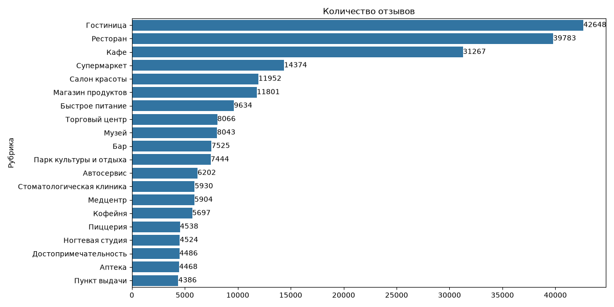
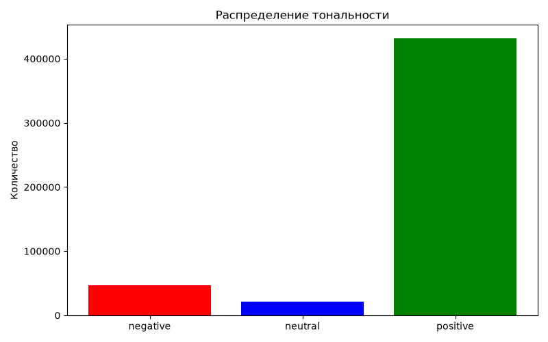
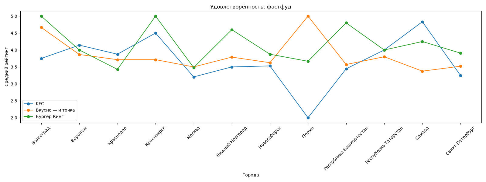
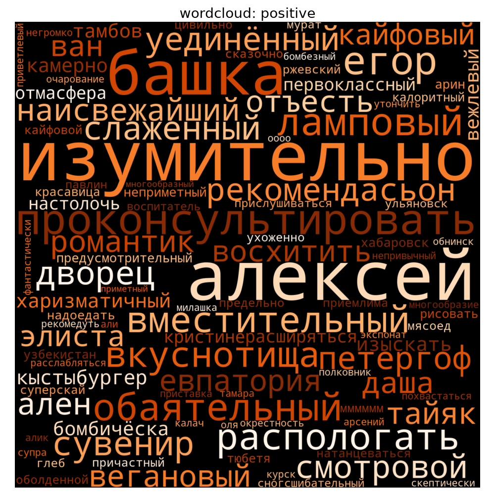

# Sentiment Analysis — Yandex Geo-Reviews

Анализ тональности отзывов об организациях из [Yandex Geo-Reviews Dataset 2023](https://www.kaggle.com/datasets/kyakovlev/yandex-geo-reviews-dataset-2023) (500 000 отзывов, январь–июль 2023): EDA, сравнение удовлетворённости по отраслям и городам, предобработка текста, классификация тональности на TF-IDF + RandomForest и сравнение с zero-shot трансформером.

Модульная версия [исходного ноутбука](https://github.com/ivanChuhonin/Yandex_project) — с исправленными багами, единой логикой разметки тональности и воспроизводимым пайплайном вместо `Run All`-ломающегося Colab-ноутбука.

## Результаты

Модель — `TfidfVectorizer(ngram_range=(1,2))` + `RandomForestClassifier`, гиперпараметры подобраны `RandomizedSearchCV`, обучена на 71 050 отзывах рубрик "Ресторан"/"Кафе" (71/25/29% train/test — стратифицировано). Тональность: `rating` 1–2 → negative, 3 → neutral, 4–5 → positive.

| Класс | Precision | Recall | F1 | Support |
|---|---|---|---|---|
| negative | 0.56 | 0.82 | **0.67** | 1289 |
| neutral | 0.28 | 0.24 | **0.26** | 782 |
| positive | 0.97 | 0.93 | **0.95** | 12139 |
| **accuracy** | | | **0.88** | 14210 |
| macro avg | 0.60 | 0.66 | 0.62 | |

Для сравнения на том же test-split прогнан zero-shot `blanchefort/rubert-base-cased-sentiment` (see `transformer_sentiment.py`) — результат практически идентичный (accuracy 0.88, macro F1 0.62, neutral F1 0.27). Более тяжёлая предобученная модель не дала прироста: `neutral` — не проблема выбора модели, а следствие того, что 3-звёздочные отзывы текстуально пограничны между позитивом и негативом (ошибки в обоих подходах делятся примерно поровну между "ушёл в negative" и "ушёл в positive").

### Визуализации

<table>
<tr>
<td></td>
<td></td>
</tr>
<tr>
<td></td>
<td></td>
</tr>
</table>

Полный набор графиков — в `reports/` после запуска пайплайна.

## Структура проекта

```
sentiment_analysis/
├── config.py                # пути, random seed, маппинг тональности, бизнес-константы
├── data_loading.py          # скачивание датасета через Kaggle API, загрузка/разметка CSV
├── preprocessing.py         # очистка, токенизация, лемматизация (pymorphy3), стоп-слова
├── vectorize.py             # TF-IDF, частотные/уникальные слова по классам тональности
├── visualize.py             # EDA-графики и графики бизнес-анализа
├── train.py                 # sklearn Pipeline (препроцессинг+TF-IDF+RandomForest), тюнинг
├── evaluate.py               # classification_report, инференс на новом тексте
├── main.py                   # CLI-оркестратор всего пайплайна
├── transformer_sentiment.py  # zero-shot сравнение с предобученным rubert-sentiment
├── requirements.txt
├── .env.example               # шаблон для Kaggle-кредов
├── data/, models/, reports/   # датасет, обученная модель, графики (генерируются, не в репо)
```

## Установка

```bash
python -m venv venv
venv\Scripts\activate            # Windows; source venv/bin/activate на Linux/Mac
pip install -r requirements.txt

# для transformer_sentiment.py: CPU-сборка torch отдельно, чтобы не тянуть CUDA
pip install torch --index-url https://download.pytorch.org/whl/cpu
```

Скопируйте `.env.example` в `.env` и впишите свои Kaggle-креды (Settings → API → Create New Token на kaggle.com):

```
KAGGLE_USERNAME=...
KAGGLE_KEY=...
```

## Запуск

```bash
python main.py                          # полный пайплайн: скачивание, EDA, обучение, оценка
python main.py --skip-download          # если CSV уже лежит в data/
python main.py --sample-frac 0.05       # быстрый прогон на 5% данных
python main.py --search-iter 20         # больше итераций RandomizedSearchCV

python transformer_sentiment.py                    # zero-shot сравнение на полном test-split (~40 мин на CPU)
python transformer_sentiment.py --sample-size 1000  # быстрая проверка
```

Обученная модель сохраняется в `models/sentiment_model.joblib`:

```python
import train, evaluate
pipeline = train.load_model()
evaluate.predict_sentiment(pipeline, ["Очень вкусно и быстро обслужили!"])
# ['positive']
```

## Что исправлено по сравнению с оригинальным ноутбуком

- Единая логика тональности (1-2/3/4-5 → negative/neutral/positive) вместо разъезжающихся 5-классовой/3-классовой/бинарной трактовок в разных ячейках.
- Препроцессинг — часть sklearn `Pipeline`, а не отдельный шаг: раньше модель обучалась на лемматизированном тексте, а инференс шёл на сыром — реальное рассинхронизация train/inference.
- Бизнес-анализ (фастфуд/маркетплейсы/супермаркеты по городам) считается на полном датасете, а не после фильтрации по рубрике "Ресторан/Кафе" — маркетплейсы и супермаркеты под эту рубрику не попадают, графики в оригинале были почти пустыми.
- `RandomizedSearchCV` реально используется для подбора гиперпараметров (в ноутбуке был импортирован, но не вызывался).
- `pymorphy2` заменён на поддерживаемый `pymorphy3` (оригинальный пакет не работает на Python 3.11+).
- Лемматизация кэшируется на уровне слова — прогон 71k отзывов ускорился с десятков минут до ~1.5 минут за счёт переиспользования разбора повторяющихся словоформ.

## Источник данных

[Yandex Geo-Reviews Dataset 2023](https://www.kaggle.com/datasets/kyakovlev/yandex-geo-reviews-dataset-2023) — 500 000 отзывов об организациях на Яндекс Картах, январь–июль 2023.
